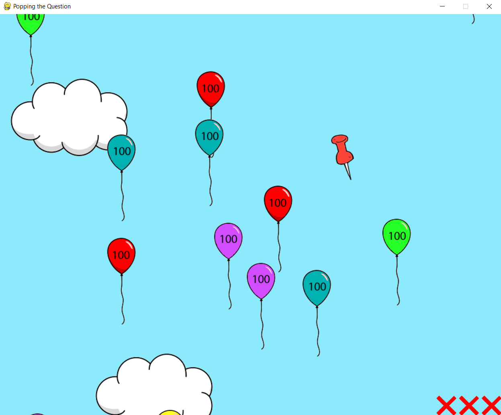
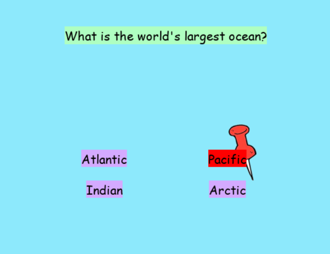

# Popping the Quesion: A Trivia Game!

This is a game I made for a project in highschool. It was made in python using pygame.

Popping the Question is a trivia game where you have to pop balloons and answer questions correct to win the game. If you get a question wrong, you will lose a strike, and you only start with 3!

See the images below for a look into the game!

